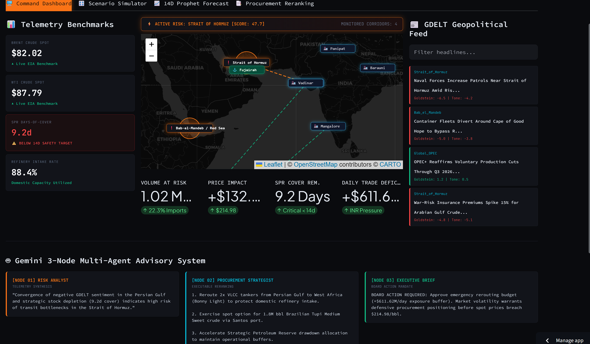
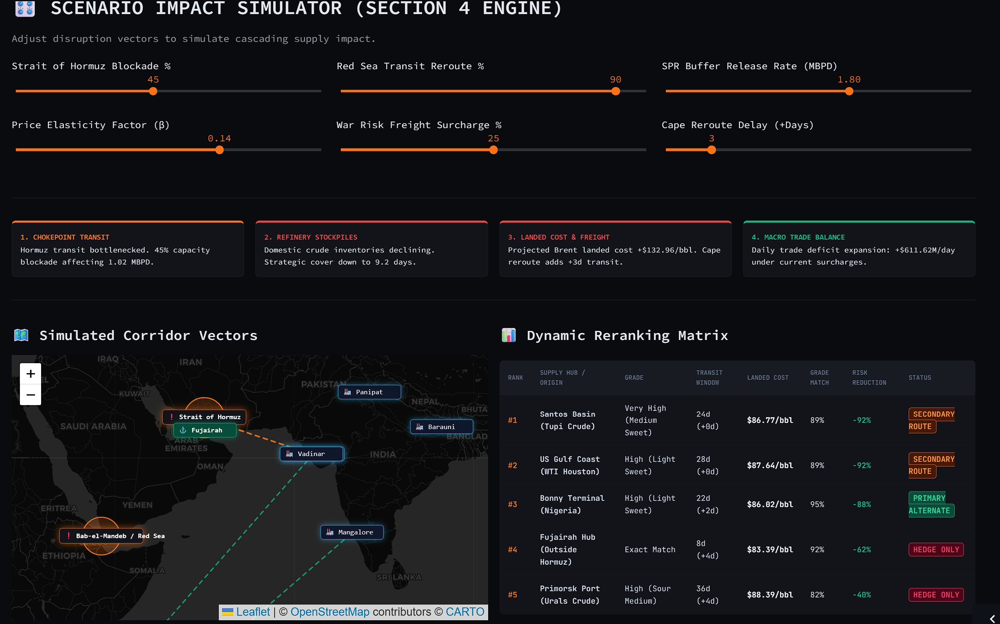
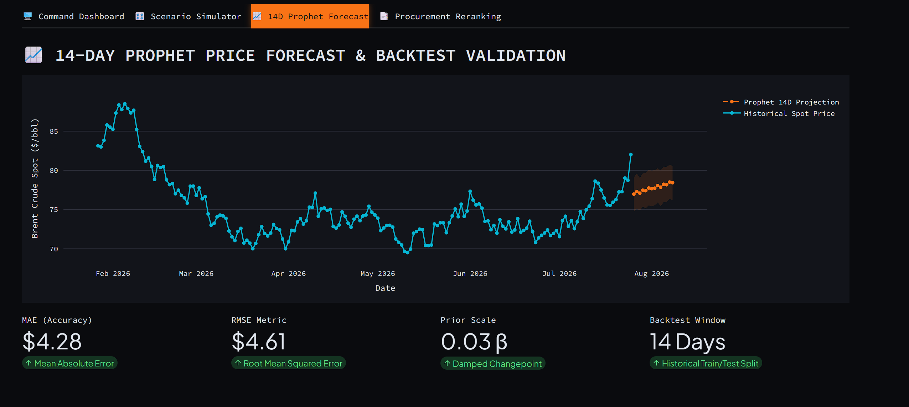
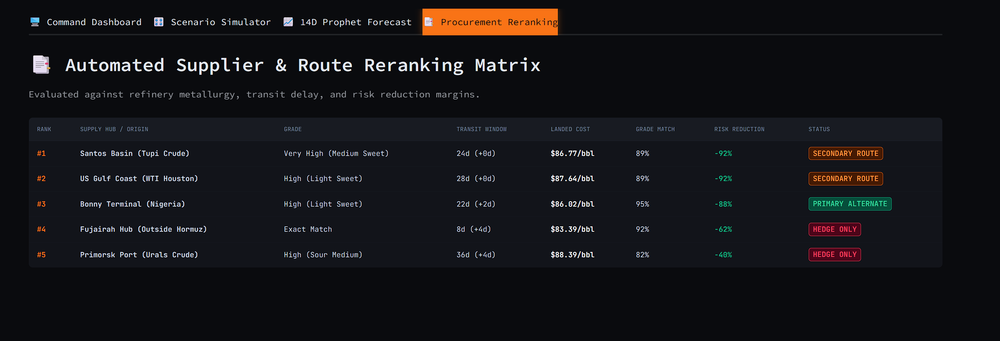
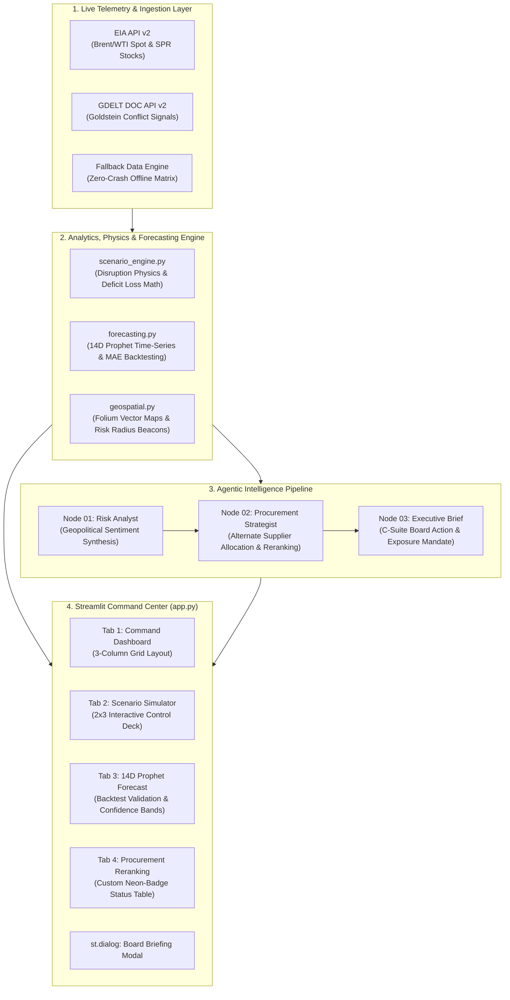

# 🛢️ UrjaPulse AI — Energy Supply Chain Resilience Platform


UrjaPulse AI is an executive-level command dashboard engineered to model, forecast, and mitigate geopolitical disruptions across critical maritime oil transit corridors (Strait of Hormuz, Bab-el-Mandeb / Red Sea).

By synthesizing live EIA energy benchmarks, real-time GDELT event signals, deterministic supply-cascade math, Meta Prophet time-series forecasting, and a sequential 3-Node Gemini multi-agent system, UrjaPulse AI provides instant strategic visibility and procurement reranking for C-suite decision-makers.

---

## 📸 Live Preview

<table>
<tr>
<td width="50%">

**Command Dashboard**
Real-time Brent/WTI benchmarks, SPR days-of-cover, GDELT geopolitical feed, and the 3-Node Gemini advisory stream.



</td>
<td width="50%">

**Scenario Impact Simulator**
Six-slider disruption engine — blockade %, reroute %, SPR release rate, elasticity, freight surcharge, and Cape delay — feeding a live reranking matrix.



</td>
</tr>
<tr>
<td width="50%">

**14D Prophet Forecast**
Damped-trend Brent projection with confidence band, plus MAE / RMSE backtest metrics against historical spot price.



</td>
<td width="50%">

**Procurement Reranking**
Automated supplier/route matrix scored on landed cost, grade match, and risk reduction, with status badges (Primary Alternate / Secondary Route / Hedge Only).



</td>
</tr>
</table>

> **Setup:** create a `screenshots/` folder at the repo root and drop your dashboard captures in with these exact filenames — GitHub resolves the paths above automatically once pushed. No CDN, no external hosting needed.

```
UrjaPulseAI/
└── screenshots/
    ├── command-dashboard.png
    ├── scenario-simulator.png
    ├── prophet-forecast.png
    └── procurement-reranking.png
```

---

## 🏗️ System Architecture



---

## 📂 Repository Structure

```
UrjaPulseAI/
├── .streamlit/
│   └── config.toml            # Dark command-center theme configuration
├── data/
│   ├── eia_client.py          # EIA API v2 benchmark connector
│   ├── gdelt_client.py        # GDELT v2 geopolitical signal parser
│   ├── fallback_data.py       # Offline shock-absorber stream engine
│   └── industrial_registry.py # Maritime chokepoint & refinery specs
├── modules/
│   ├── scenario_engine.py     # Disruption physics math & reranking matrix
│   ├── forecasting.py         # Prophet model fitting & MAE/RMSE metrics
│   ├── geospatial.py          # Folium vector map & glowing HTML DivIcons
│   └── advisory.py            # 3-Node Gemini Multi-Agent System (google-genai)
├── .gitignore                 # Repository governance exclusions
├── app.py                     # Master Streamlit Command Center
├── config.py                  # Macro constants & risk threshold defaults
└── requirements.txt           # Production dependency constraints
```

---

## ⚙️ Core Capabilities

- **Live Geopolitical Telemetry** — Ingests daily EIA spot prices alongside real-time GDELT event streams, calculating dynamic Goldstein conflict scores to quantify transit risk.
- **Interactive Disruption Simulator** — Adjust blockade severity, freight surcharges, and price elasticity (β) to compute immediate volume at risk, SPR depletion rates, and daily trade deficit expansion ($M/day).
- **Prophet Price Forecasting** — Fits a damped 14-day time-series model with 80% confidence intervals and historical train/test split backtest metrics (MAE / RMSE).
- **Geospatial Risk Mapping** — Renders interactive dark vector maps with custom HTML DivIcons highlighting refineries, supply hubs, and active flow vector lines with no page-refresh reloads.
- **3-Node Sequential Multi-Agent Advisory** — Uses Gemini 2.5 Flash via the official `google-genai` SDK to execute a structured advisory chain:
  - **Node 01 (Risk Analyst)** — Synthesizes telemetry into conflict summaries.
  - **Node 02 (Procurement Strategist)** — Generates actionable alternate supplier reranking.
  - **Node 03 (Executive Brief)** — Drafts C-suite board briefs with exact financial exposure figures.

---

## 🚀 Quickstart Guide

### Local Setup

**1. Clone the repository**
```bash
git clone https://github.com/YourUsername/UrjaPulseAI.git
cd UrjaPulseAI
```

**2. Create and activate a virtual environment**
```bash
python -m venv venv

# Windows (CMD)
venv\Scripts\activate

# macOS / Linux
source venv/bin/activate
```

**3. Install dependencies**
```bash
pip install -r requirements.txt
```

**4. Set up local credentials**

Create a `.env` file in the project root:
```env
EIA_API_KEY=your_eia_api_key_here
GEMINI_API_KEY=your_gemini_api_key_here
```

**5. Launch the application**
```bash
streamlit run app.py
```

---

### ☁️ Streamlit Cloud Deployment

1. Push the code to GitHub (ensure `.env` and `venv/` are excluded via `.gitignore`).
2. Connect your repository to [Streamlit Community Cloud](https://streamlit.io/cloud).
3. Set **Main file path** to `app.py`.
4. Add your API keys under **Advanced Settings → Secrets**:

```toml
EIA_API_KEY = "your_actual_eia_key"
GEMINI_API_KEY = "your_actual_gemini_key"
```

---

## 📄 License

Distributed under the MIT License.
